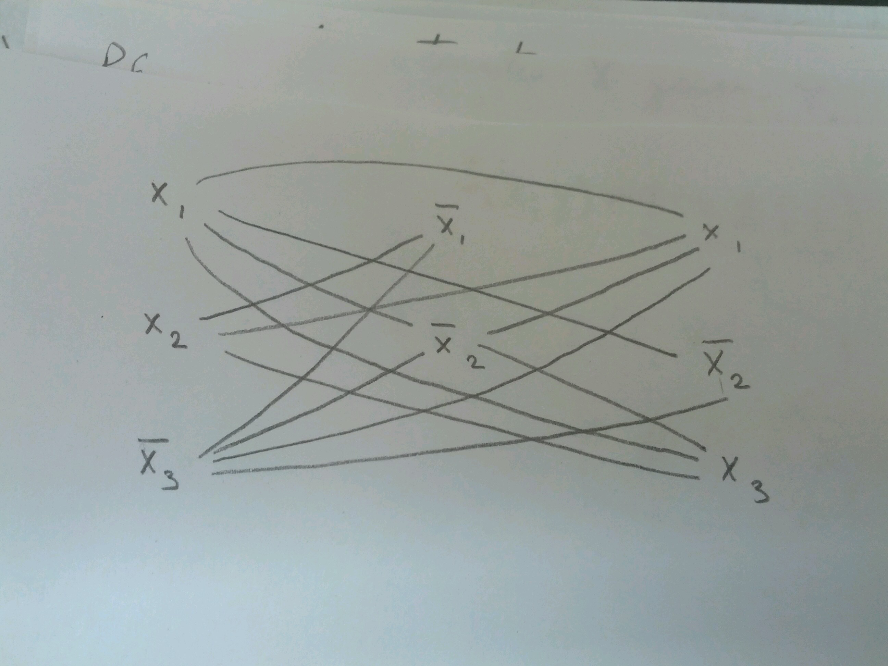

.. epigraph::

	Why do you speak to me of the stones? It is only the arch that matters to me.

	--K. K.

********************************
k-clique :math:`\in` NP-Complete
********************************

Transforming CNF-SAT problem into k-clique problem:

:math:`E = (x_1 + x_2 + \bar x_3) * (\bar x_1 + \bar x_2) * (x_1 + \bar x_2 + x_3)`

In each term of the product of sums, one of the summands must have a value of True.

The lines of the graph were drawn such that the nodes they connect are mutually satisfiable - i.e. do not contain a contradiction.

We need a bijective transformation from CNF-SAT to k-clique.

Suppose :math:`E` is satisfiable. Then each clause has a True literal flag, and the vertices corresponding to those clauses **must** form a k-clique in the graph.

Now suppose the graph :math:`G` has a k-clique. Then the k-clique must contain 1 vertex from each vertical set. (since there are no connections within a vertical set by construction). And, again by construction, since they are mutually adjacent in the graph, they must not contradict each other.

Therefore, since a polynomial-time transformation exists from CNF-SAT to k-clique, k-clique is NP-Complete.

Partition & Subset-Sum
======================
Partition
---------
Given a set of integers, is there a subset that sums to exactly :math:`\frac{1}{2}` the total?

Subset-Sum
----------
Given a set of integers, and a target integer, :math:`k`, is there a subset that sums to :math:`k`?

It is clear that every instance of Partition is also an instance of Subset-Sum (let :math:`k=\frac{1}{2}`). Therefore, Partition :math:`\propto` Subset-Sum.

In general, special cases *always* reduce to general cases.

Does Subset-Sum :math:`\propto` Partition?
------------------------------------------
Given an instance of Subset-Sum, :math:`S= \{...\}`, :math:`k`. (Can we split :math:`S` into :math:`S_1 = \{...\}`, :math:`S_2 = \{...\}` s.t. :math:`S_1` sums to :math:`k`?)

Try to construct :math:`S'` so that :math:`S'` has a partition **iff** :math:`S` has a subset summing to :math:`k`.

Try adding some value :math:`x` to :math:`S`.

:math:`S' = \{s_1, ... s_n, x\}`

split :math:`S'` into :math:`S_1'` and :math:`S_2'` such that they have the same sum.

:math:`S_1' = \{..., x\}` :math:`S_2' = \{\text{all from } S\}`

Let :math:`T = \sum_S`

if :math:`S` has a subset summing to :math:`k`,

:math:`S_1 = \{...\}` sums to :math:`k`, :math:`S_2 = \{...\}` sums to :math:`T-k`.

So let :math:`T-k +x = k` to make them equal partitions. Equivalently, :math:`x = 2k - T`.

So with out Subset-Sum problem :math:`(S, k)`, construct :math:`S' = S \cup \{2k-T\}` where :math:`T=` total sum of S.

Then :math:`\sum S' = \sum S + 2k - T = 2k`

This transformation is bijective, and this shows that Subset-Sum :math:`\propto` Partition.
