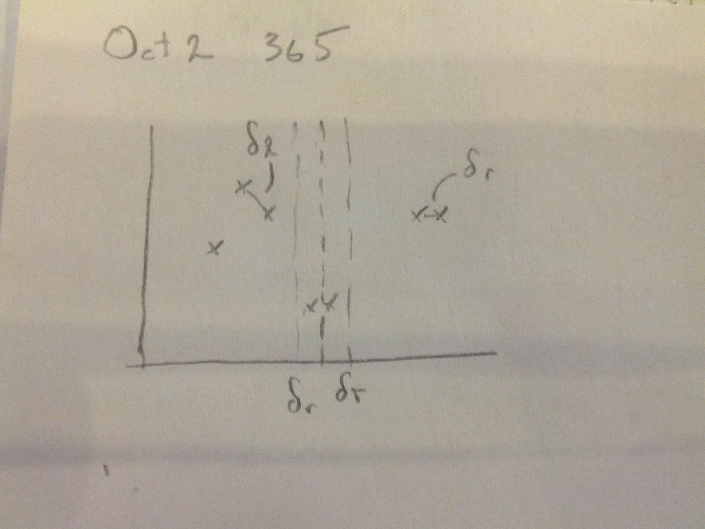
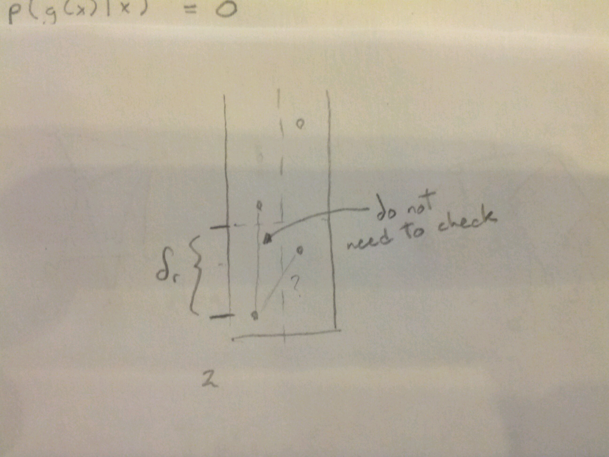
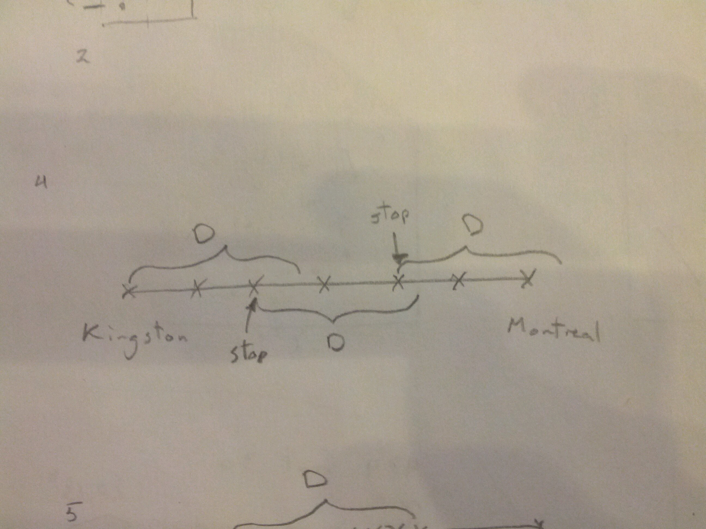

..epigraph::
	We cannot prevent the Singularity

	Happy Birthday to Verner Vinge

	(author of *True Names*, *Fire Upon the Deep*)

***********************
More Divide and Conquer
***********************

* Split the points into 2 horizontally separate halves: Left & Right

* Solve recursively on L & R

* Look for points across the dividing line that are close together. (*)

What if all the points are in a vertical line?

Still can constrain to a rectangle of :math:’\delta_r \times 2\delta_r‘

And there’s only 5 other points to compare to (the vertices of the rectangle)

.. note::
	Could be 7 closest points, worst case if two equal points on dividing line somehow get sorted to either side. Actually definitely less than 7 (even less than 5), but we're sure it's less than 7.

.. image:: .static/10.02.3.jpg
	:width: 50%

(*) becomes then, 
* Find the points in the vertical strip of interest for each point, compute its distance to the 5 (7) points closest above this point, looking for points that are close together.

.. math::
	Time(n) = 2Time(\frac{n}{2})+O(n)+O(n\log n)

	= O(n\log n)

Road Trip
=========

* range of car on single tank of gas :math:`=D`.
* want to make as few stops as possible

.. note::
	optimal solution is not unique

.. image:: .static/10.02.5.jpg
	:width: 50%
