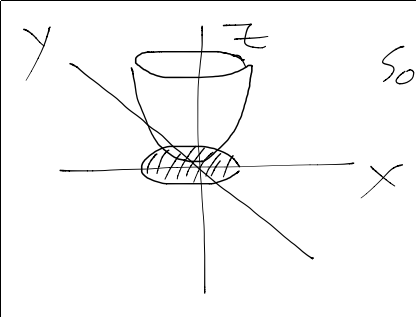
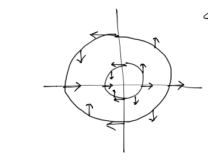
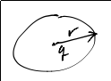

******************************
Visualization of Maps and Loci
******************************

More Tricks
===========

.. math::
	(1+i)(1+2i)(1+3i) = (-1+3i)(1+3i) = -1-9 = -10

has an angle of :math:`-\pi`. 

:math:`1+in` has angle :math:`\arctan n`.

.. image:: .static/IMG_20130912_200206.jpg
	:width: 50%

So, adding the arguments of each factor together,

.. math::
	\arctan 1 + \arctan 2 + \arctan 3 = -pi

cool, huh.

.. admonition:: Definition
	Argument

	Denoted :math:`arg(z)`, :math:`arg(z) = \{\theta \in \Bbb R | z = |z|(\cos \theta + i \sin \theta)\}`

If :math:`\theta_0 \in arg(z)`, then :math:`arg(z) = \{\theta_0 + 2\pi k | k \in \Bbb Z\}`

.. admonition:: Definition
	Principal Argument

	Denoted :math:`Arg(z)` (with an upper-case 'A'), :math:`Arg(z)=arg(z) \cap (-pi, pi)`

Visualizing Maps
================
Multiplication by a scalar
--------------------------
Consider the following function.

:math:`f_c(z) = cz` for :math:`c \in /Bbb C`

What does it look like?

if :math:`|c| = 1`, then :math:`c` is on the unit circle. So, the mapping multiplies the modulo of :math:`z` by 1, and rotates the argument of :math:`z` by :math:`arg(c)`.

If :math:`|c| < 1`, then :math:`f_c(z)` is a rotation of :math:`arg(c)` *and* a contraction by a factor of :math:`|c|`

If :math:`|c| > 1`, then :math:`f_c(z)` is a rotation of :math:`arg(c)` and an *expansion* by a factor of :math:`|c|`

Okay, well that's not too complicated thanks to De Moivre's Formula. What about somehting like :math:`f(z) = z^2`?

For :math:`f(x) = x^2` on :math:`\Bbb R`, this is easy:

.. image:: .static/2013-09-12-203030_142x107_scrot.png
	:width: 50%

but :math:`f: \Bbb C \to \Bbb C`, it's like a map from :math:`\Bbb R^2 \to R^2`, and most of us can't think in 4D.

Plot magnitude: :math:`|f(z)|` is a plot from :math:`\Bbb R^2 \to \Bbb R`, so the graph is 3D.

So if :math:`f(z) = z^2`, :math:`|f(z)| = |z^2| = |z|^2 = x^2 + y^2` - a paraboloid.

But the magnitude only tells half of the story. We can also plot the argument mapping: :math:`f(z) = z^2` doubles angles. We can visualize this as a vector field:

We could put the vector field on the Magnitude plot as well, but then things get cluttered.

Using Grid-Lines to Visualize Functions
---------------------------------------

.. image:: .static/2013-09-12-204035_146x127_scrot.png
	:width: 20%

curve is :math:`a+it` for :math:`t \in \Bbb R`.

Let :math:`f(z) = z^3`.

Then, mapping the curve under the map :math:`f(z)`,

.. math::
	f(a + it) = (a^2 - t^2 + 2iat)(a + it) = a^3 - 2at - at^2 + i(3a^2t -t^3)

There isn't a nice implicit formula for this;

Paramterizing this equation with :math:`t^2 = \frac{x-a^3)}{-3a}`,

.. math::
	9a^4t^2 - 6a^2t^4 + t^6 = y^2

And the plot:

.. image:: .static/2013-09-12-220029_549x271_scrot.png
	:width: 50%

Geometric Loci
==============
We can describe geometric objects (usually lines and circles) as *loci*.

:math:`|z-q|` is the distance between :math:`z` and :math:`q`.

So, 

1. :math:`|z-q| = r` where :math:`q \in \Bbb C` and :math:`r \in \Bbb R_{>0}` is a circle centered at q with radius r.

2. :math:`\frac{|z-3|}{|z+3|} = 1 \iff |z-3| = |z+3|` is a line centered between -3 and 3.

.. image:: .static/2013-09-12-220650_121x108_scrot.png
	:width: 20%

3.

.. math::
	\frac{z-3}{z+3} = 2

	\iff |z-3| = 2|z+3|

	\iff |z-3|^2 = 4|z+3|^2

	\iff (x-3)^2 + y^2 = 4(x+3)^2 + 4y^2

	\iff x^2 - 6x + 9+ y^2 = 24x + 36 +4y^2

	\iff 3x^2 + 30x + 27 + 3y^2 = 0

	\iff x^2 + 10x + 9 + y^2 = 0

	\iff (x+5)^2 - 16 + y^2 = 0

	\iff (x+5)^2 + y^2 = 16

is a circle centered at :math:`-5 + 0i`

In general, :math:`p, q \in \Bbb C`, :math:`r \in \Bbb R_{>0}` describes a line if :math:`r=1`, and a circle otherwise.

.. admonition:: Corollary 1

	:math:`a, b, c, d \in \Bbb C`, :math:`r \in \Bbb R_{>0}`.

	Solutions to :math:`|\frac{az+b}{cz+d}| = r` also form a circle or a line.

	Proof:

	Factor out :math:`|\frac{a}{c}|`, to get the same form as above.

.. admonition:: Corollary 2

	:math:`a, b, c, d \in \Bbb C`, :math:`r \in \Bbb R_{>0}`.

	Solutions to :math:`|\frac{az + b}{cz + d} - q|=r` are also a line or circle.

	Proof:

	:math:`\frac{az+b}{cz+d}-q = \frac{(a-cq)z + (b-dg)}{cz + d}`

