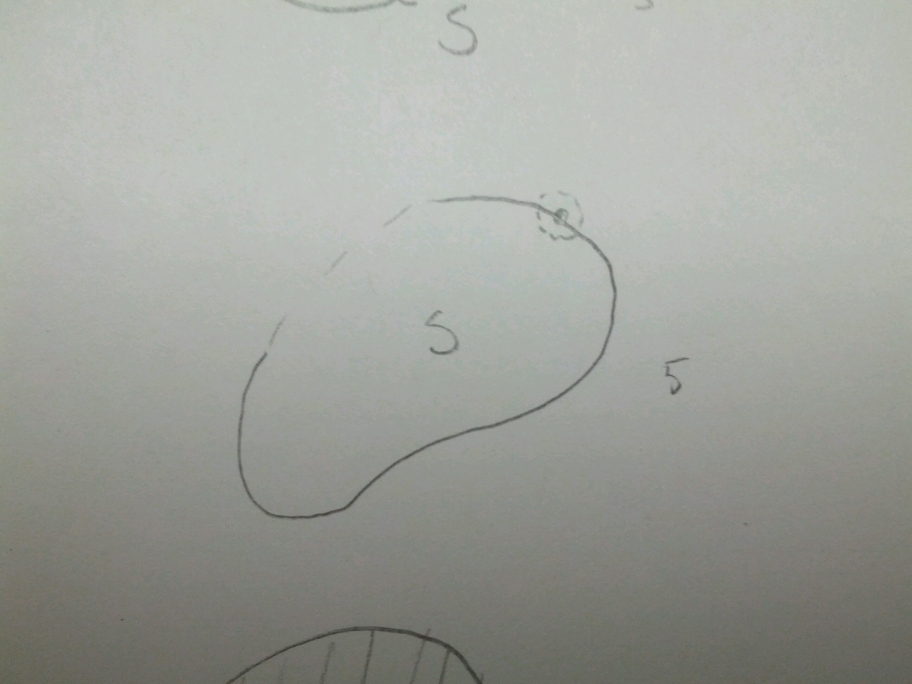

*********************
Limits and Continuity
*********************

Point-Set Topology
==================
Let :math:`S \subseteq \Bbb C`, :math:`q \in \Bbb C`, :math:`\rho > 0`.

Let :math:`D_p(q) = \{x \in \Bbb C | |z-q| < \rho \}`.

.. image:: .static/09.23.1.jpg
	:width: 50%

In words, this is the disk centered at :math:`q`, radius :math:`\rho`.

And define :math:`D^*_p(q) = \{z \in \Bbb C | 0 < |z-q| < \rho \}`

.. image:: .static/09.23.2.jpg
	:width: 50%

In words, this is the *punctured disk* centered at :math:`q`.

.. admonition:: Definition

	We say that a point :math:`z_0 \in S` is in the *interior* of :math:`S` if :math:`\exists \rho > 0` such that :math:`D_p(z_0) \subset S`

	.. image:: .static/09.23.3.jpg
		:width: 50%

.. admonition:: Definition

	We say that a point :math:`z_0` is a *boundary point* of :math:`S` if :math:`\forall \rho > 0`, :math:`D_\rho(z_0) \cap S \neq \{\}`, :math:`D_\rho(z_0) \cap S^C \neq \{\}`.

	.. image:: .static/09.23.4.jpg
		:width: 50%

Exterior point:

.. admonition:: Definition

	We say a set is *open* if (1) Every :math:`z_0 \in S` is an interior point of :math:`S`, or, equivalently, (2) :math:`S` contains no boundary points.

Roughly, if the set is defined by a strict inequality, then the set will be open.

.. admonition:: Example

	:math:`S = \{ z \in \Bbb C | 2 < |z| < 5\}` is open.

Dotted lines are used in diagrams to show that the boundary is not included in the set. Conversely, closed lines mean boundary is included.

.. admonition:: Definition

	We say that a set is *closed* if (a) it contains all of its boundary points, or, equivalently, (b) its complement is open.

Roughly, if the inequality is not strict, the set is closed.

Is :math:`\Bbb R` closed?

In the complex plane, 

.. image:: .static/09.23.6.jpg
	:width: 50%

we can draw a neighbourhood around any point in :math:`\Bbb C - \Bbb R` that does not touch the real axis. So :math:`\Bbb C - \Bbb R` is open, and therefore, :math:`\Bbb R` is closed.

.. admonition:: Definition

	A set :math:`S \subseteq \Bbb C` is *path connected* if for every pair :math:`z_0, z_1 \in S`, there exists a continuous map :math:`\gamma: [0,1] \to S` such that :math:`\gamma(0) = z_1` and :math:`\gamma(1) = z_2`.

.. image:: .static/09.23.7.jpg
	:width: 50%

An open set is path-connected if for all :math:`z_1, z_2 \in S`, there is a sequence of line segments in :math:`S` joining :math:`z_1` and :math:`z_2`.

.. image:: .static/09.23.8.jpg
	:width: 50%

An open path-connected set in :math:`\Bbb C` is called a *domain*. These are sets that are good for continuity, differentiability, and integration.

Limits
======
.. admonition:: Definition

	Convergence

	We say that a sequence of points in :math:`\Bbb C`, :math:`\{z_n\} \subseteq \Bbb C` of points in :math:`\Bbb C` converges to a limit, :math:`L \in \Bbb C`, if :math:`\forall \epsilon > 0`, :math:`\exists N \in \Bbb N`, such that :math:`|z_n - L| < \epsilon` for all :math:`n > N`.

	We write: :math:`lim_{n \to \infty} z_n = L`; sequence is *convergent*.

This definition is very similar to convergence on the real line.

.. image:: .static/09.23.9.jpg
	:width: 50%

If :math:`f: S \subseteq \Bbb C \to \Bbb C` and :math:`D_p^*(z_0) \subseteq S`, :math:`\rho > 0`, then we say :math:`lim_{z \to z_0} f(z) = L` if :math:`\forall \epsilon > 0`, :math:`\exists \delta > 0` such that :math:`|f(z) - L| < \epsilon` if :math:`0 < |z - z_0| < \delta`.

.. image:: .static/09.23.10.jpg
	:width: 50%

Proposition 1:
--------------
A limit is unique if it exists.

Proof:

Assume :math:`lim_{z \to z_0} f(z) = a` and :math:`lim_{z \to z_0} f(z) = b`.

Then, for all :math:`\epsilon > 0`, :math:`\exists \delta_1, \delta_2` such that if :math:`0 < | z-z_0| < \delta_1`, then :math:`|f(z) - a| < \epsilon/2`.

And if :math:`0 < | z - z_0| < \delta_2`, :math:`|f(z) - b| < \epsilon/2`.

So let :math:`\delta = min(\delta_1, \delta_2)`. Then if :math:`0 < | z_0 - z| < \delta` then :math:`|a-b| < |f(z) - a| + |f(z) -b | < \epsilon/2 + \epsilon/2 = \epsilon.`
