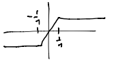

***************************************
Convergent Series of Analytic Functions
***************************************

.. admonition:: Definition (Pointwise convergence of complex functions)

    Given a sequence of functions

    .. math::
        f_n:S\to\mathbb C

    :math:`n=1,2,3,...`, we say :math:`f_n` *converges to* :math:`f` *pointwise* if :math:`\forall z\in S`,

    .. math::
        \lim_{n\to\infty}f_n(z)=f(z)

    i.e. :math:`\forall z\in S`, :math:`ε>0`, :math:`\exists N` s.t. :math:`|f_n(z)-f(z)|<ε` :math:`\forall n\geq N`.

We can also consider pointwise convergence of a sum of functions

.. math::
    f(z)=\sum_{k=1}^\infty g_k(z)

if

.. math::
    f_n(z)=\sum_{k=1}^n g_k(z)

If :math:`f_n\to f` pointwise, we say :math:`\{f_n\}` is the sequence of partial sums.

We want to know:

If :math:`f_n` are continuous (or holomorphic), is :math:`f`?

Does

.. math::
    \int_γ f_n(z)dz\to\int_γ f(z)dz

Without more restrictions, the answer is **no**.

Consider the real-valued functions

.. math::
    f_n=\begin{cases}
        -1 && x<-\frac{1}{n}\\
        nx && -\frac{1}{n}\leq x\leq \frac{1}{n}\\
        1  && x > \frac{1}{n}
        \end{cases}

Then

.. math::
    \lim_{n\to\infty}f_n(z)=\begin{cases}
        -1 && x<0\\
        0  && x=0\\
        1  && x>0
        \end{cases}

:math:`f_n` defined by the picture:

.. image:: .static/11.07.2.png
    :width: 50%

where we have :math:`\lim_{n\to\infty}f_n=0` *but* :math:`\lim_{n\to\infty}\int_0^1 f_n(x)dx=\lim_{n\to\infty} 1=1`.

So pointwise convergence doesn't always preserve continuity or integrals.

The following convergence definition does.

.. admonition:: Definition (Uniform Convergence)

    .. math::
        f_n:S\to\mathbb C\text{ (or }\mathbb R\text{)}

    converges *uniformly* on :math:`S` if :math:`\forall ε>0`, :math:`\exists N` s.t. if :math:`n\geq N`, :math:`|f_n(z)-f(z)|<ε` :math:`\forall z\in S`.

    .. note::
        The subtle difference between this definition and the definition of pointwise convergence is that, in the uniform case, there must exist an :math:`N` for the given :math:`ε>0` that holds *for all* :math:`z\in S` at once.

    We say that :math:`f_n\to f` *uniformly on compact sets* (also called Locally Uniformly (LU) Convergent) in :math:`S` if for any compact subset :math:`K\subset S`, :math:`f_n\to f` uniformly on :math:`K`.

    Often, uniformly on compact subsets is enough to get what we need.

.. admonition:: Lemma

    If :math:`f_n\to f` uniformly on compact sets in :math:`S` and :math:`γ\subset S` is a bounded curve, then

    .. math::
        \lim_{n\to\infty}\int_γf_n(z)dz=\int_γ\lim_{n\to\infty} f_n(z)dz=\int_γf(z)dz

    Proof:

    .. math::
        |\int_γ f_n(z)dz-\int_γf(z)dz|=|\int_γf_n(z)-f(z)dz|\\
        \leq length(γ)max_{z\in γ}|f_n(z)-f(z)|

    But, :math:`\forall ε>0`, :math:`\exists N` s.t. :math:`|f_n(z)-f(z)|<ε` on :math:`γ` (compact) for :math:`n\geq N`. So

    .. math::
        \lim_{n\to \infty}|\int_γ f_n(z)dz-\int_γ f(z)dz|\\
        <length(γ)ε

    (for all :math:`ε>0`)

    .. math::
        =0

    .. admonition:: Corollary

        If

        .. math::
            f_n(z)=\sum_{k=1}^n g_n(z)\to f(z)=\sum_{k=1}^\infty g_n(z)

        uniformly on compact sets on :math:`z\in S` and :math:`γ\subset S` (bounded curve), then

        .. math::
            \lim_{n\to\infty}\sum_{k=1}^n\int_γ g_n(z)dz&=\lim_{n\to\infty}\int_γ f_n(z)dz\\
            &=\int_γ f(z)dz\\
            &=\int_γ \sum_{k=1}^\infty g_n(z)

        So

        .. math::
            \sum_{k=1}^\infty\int_γ g_n(z)dz=\int_γ\sum_{k=1}^\infty g_n(z)dz
    
