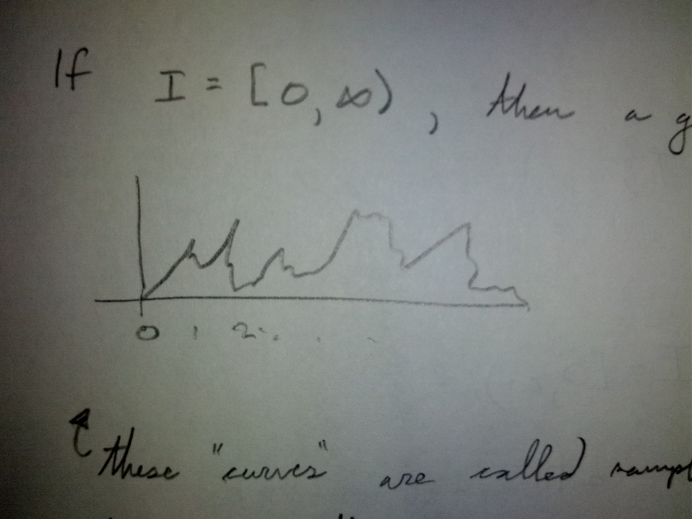
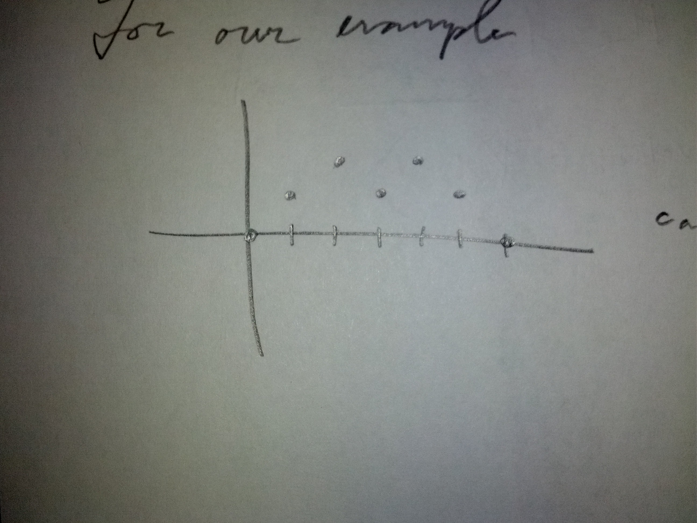

**********************************
Introduction to Stochastic Process
**********************************

.. admonition:: Definition

	A **Stochastic Process** is a collection of random variables,

	.. math::
		\left\{ X_{u}; u \in I \right\}

There are 2 fundamental properties of a stochastic process.

1. The index set :math:`I`. Typically, we will take
   :math:`I=\left\{ 0, 1, 2, ... \right\}` or :math:`I=[0,\infty)`
   In the first case, :math:`I` is discrete, in the second, :math:`I` is a
   continuous index set.
2. If :math:`S_{u}` is the sample space of :math:`X_{u}`, then
   :math:`S = \cup_{u \in I} S_{u}` is the **state space** of the stochastic
   process. (i.e. :math:`S` is the set of all possible values of
   :math:`X_{u}'s`)

Example
^^^^^^^
Let :math:`Y_{1}, Y_{2}, ..., Y_{n}` be *independent* random variables with:

.. math::
	P(Y_{i} = -1) = P(Y_{i} = 1) = \frac{1}{2}, \forall i \in \left\{1, 2, ...,
	n\right\}

Let :math:`X_{0}=0` and :math:`X_{n} = \sum_{i=1}^{n} Y_{i}` for :math:`n \ge 1`

Here, :math:`I=\mathbb Z_{\ge 0}` and :math:`S=\mathbb Z`

for every given :math:`n`, :math:`X_{n}` can take values
:math:`-n, -n+2, ..., n-2, n`

The Distribution of Stochastic Processes
========================================
Recall, a random variable :math:`X`, is a function from :math:`\Omega \to \mathbb R` where :math:`(\Omega, P)` is a probability space (:math:`P` is the probability measure on :math:`\Omega`)

The **distribution** of :math:`X` is the probability law on :math:`\Bbb R` by :math:`P` under the mapping :math:`X`:

i.e. for :math:`A \subset \Bbb R`,

.. math::
	P(X \in A) = P(X^{-1}A) 

where 

.. math::
	X^{-1}A = \left\{\omega \in \Omega | X(\omega) \in A \right\}

For a stochastic process with index set :math:`I`, the collection
:math:`\left\{X_{u} | u \in I \right\}` can be thought of as a mapping from
:math:`\Omega \to \Bbb R^{I}`, where :math:`\Bbb R^{I}` is the set of all
functions from :math:`I` to :math:`\Bbb R`.  For example, if
:math:`I=\Bbb Z_{\ge 0}`, then :math:`\omega` gets mapped to
:math:`X_{0}(\omega), X_{1}(\omega), ...` which we can view as a function from
:math:`I` to :math:`\Bbb R` like so:

.. image:: .static/IMG_20130909_225813.jpg
	:width: 50 %
	:align: center

If :math:`I = [0, \infty)`, then a given :math:`\omega` maps to e.g.:

These "curves" are called sample paths of the stochastic process.

There is exactly one sample path for each :math:`\omega \in \Omega`

For our example,

