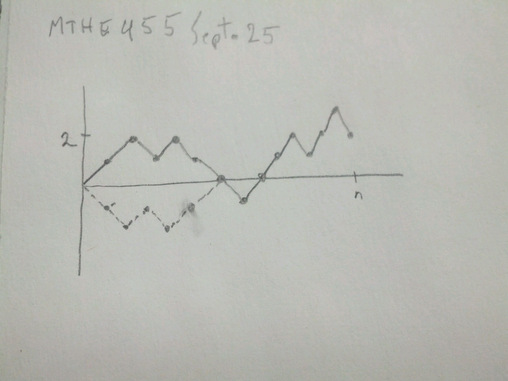

Notes on problems
=================
`Homework 1`_

1(b)

Simple Random Walk

:math:`A_{n,k}=` set of paths starting in 0 and ending in :math:`k` at time :math:`n`; :math:`k>0`.

:math:`B_{n,k}=` paths in :math:`A_{n,k}` that visit state 0 at least once after time 0.

:math:`C_{n,k}=` paths in :math:`B_{n,k}` where first step is down.

What is the :math:`P(A_{n,k} \backslash B_{n,k})`

argue by a reflection argument (see image) that the number of paths in :math:`B_{n,k}` is 2 times the number of paths in :math:`C_{n,k}`. Since each path in :math:`B_{n,k}` is equally likely,

.. math::
	P(B_{n,k}) = 2P(C_{n,k})

Then,

.. math::
	P(A_{n,k} \backslash B_{n,k}) = P(A_{n,k}) - P(B_{n,k})

	= P(A_{n,k}) - 2P(C_{n,k})

Where the probability of a given path is:

.. math::
	p^{\text{# of moves up}}(1-p)^{\text{# of moves down}}

So,

.. math::
	P(C_{n,k}) = P(\text{starting in state 0 you end in state }k+1\text{ at time }n-1)

by temporal and spatial homogeneity.

2. 

:math:`L=` generation number of the most recent ancestor of two randomly chosen (with replacement) individuals in generation :math:`n`.

.. image:: .static/09.25.2.jpg
	:width: 50%

Condition on :math:`X_r=k`

Argue that any individual in generation :math:`L` is equally likely by a symmetry argument.

Argue that two randomly chosen individuals in generation :math:`n` have the same common ancestor :math:`m` in generation :math:`r`, conditioned on :math:`X_r=k`, is :math:`\frac{1}{k}`

************************
Classification of States
************************

Relationships between pairs of states
=====================================
.. admonition:: Definition

	For two states :math:`i` and :math:`j`, we say that :math:`j` is *accessible* from state :math:`i` if :math:`p_{ij}(n) > 0` for some :math:`n`.

	.. admonition:: Example

		Branching Process with family size pmf :math:`f(k)`, :math:`k=0,1,2,...` and :math:`f(0)>0`.

		Further assume :math:`f(k) > 0` for all :math:`k`.

		Consider state :math:`i` and :math:`j` with :math:`i \neq 0` and :math:`j \neq 0`.

		State :math:`j` is accessible from :math:`i`.

		and similarly, :math:`i` is accessible from :math:`j`.

		If :math:`i>0` and :math:`j=0`, then :math:`j` is accessible from :math:`i`; however, :math:`i` is not accessible from 0.

	We write :math:`i \rightarrow j` if :math:`j` is accessible from :math:`i` and :math:`i \nrightarrow j` if not.

	If :math:`i \rightarrow j` and :math:`j \rightarrow i` then we write :math:`i \leftrightarrow j` and we say :math:`i` *communicates* with :math:`j`

	.. admonition:: Example

		Simple Random Walk, with :math:`0<p<1`. Here, every pair of states :math:`i` and :math:`j` communicate.

	If :math:`i \leftrightarrow j`, for all :math:`i,j \in S`, then we say the Markov chain is *irreducible*.

Properties of communication
---------------------------
1. :math:`i \leftrightarrow i` somce :math:`p_{ii}(0)=1`

    - i.e. :math:`\leftrightarrow` is *reflexive*
2. :math:`i \leftrightarrow j \iff j \leftrightarrow i`.

    - i.e. :math:`\leftrightarrow` is *commutative*
3. If :math:`i \leftrightarrow j` and :math:`j \leftrightarrow k`, then :math:`i \leftrightarrow k`.

	Show that :math:`k` is accessible from :math:`i`.
	- i.e. :math:`\leftrightarrow` is *transitive*

These 3 properties make :math:`\leftrightarrow` an *equivalence* relationship.

:math:`\leftrightarrow` partitions the state space :math:`S` into equivalence classes - where all states in the same class communicate with one another.

Every state :math:`i` is in some equivalence class (the class containing :math:`i`)

State :math:`i` cannot be in more than one equivalence class; suppose :math:`i \in C_1` and :math:`i \in C_2`, then any state :math:`j` in :math:`C_1` communicates with :math:`i \in C_2`, and by transitivity, :math:`j` communicates to every state in :math:`C_2` (and vice versa), so :math:`C_1=C_2`.

.. admonition:: Example

	- For the simple random walk, there is only 1 equivalence class.
	- For the branching process considered :math:`\{1,2,...\}` :math:`\{0\}` are the equivalence classes.

.. _`Homework 1`: http://www.mast.queensu.ca/~stat455/assignments/ass1/ass1.pdf
