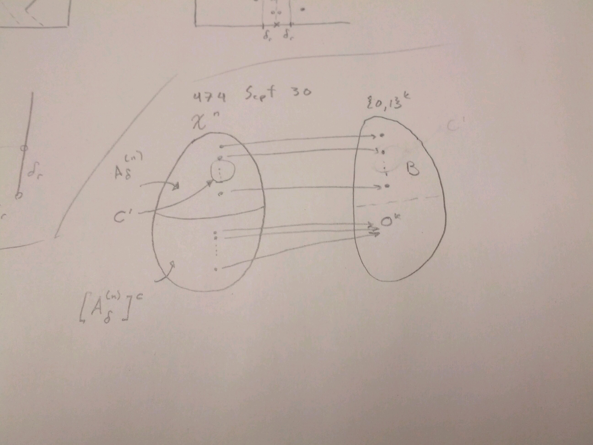

*************************************
Proof of Shannon-McMillan AEP Theorem
*************************************
Proof of (i) (Forward Achievability):
=====================================
wlog, assume that :math:`D=2` (binary codes).

Therefore, :math:`H_D(x)=H(X)` (in base 2).

Now, given :math:`\alpha>0`, :math:`\epsilon>0`, choose :math:`\delta` s.t. :math:`0<\delta<\alpha`

and choose :math:`n` and :math:`k(n)` such that

.. math::
	H(X)+\delta<\frac{k}{n}<H(X)+\alpha

Now increase :math:`n` to satisfy :math:`P[A_\delta^{(n)}]>1-\epsilon`

(which is possible by (2) of previous theorem)

while increasing :math:`k` to satisfy

.. math::
	H(X)+\delta<\frac{k}{n}<H(X)+\alpha

Encoder:
--------

* For every :math:`\delta` - typical source :math:`n` - tuple :math:`x^n \in A_\delta^{(n)}`, assign a **distinct** (not all-zero) :math:`k` - tuple on its codeword
* If :math:`x^n \notin A_\delta^{(n)}`, assign it to a default (all-zero) codeword;

.. math::
	f(x^n) = 0^k = (0,0,...,0)

This encoder is **UD** for :math:`x^n \in A_\delta^{(n)}`.

Such an encoder exists **iff**

.. math::
	2^k \geq |A_\delta^{(n)}|+1 \implies 2^k > |A_\delta^{(n)}|

But we have chosen :math:`k` and :math:`n` (sufficiently large) to satisfy

.. math::
	\frac{k}{n} > H(X)+\delta \iff 2^k > 2^{n(H(X)+\delta)}

But we know that :math:`2^{n(H(X)+\delta)} \geq |A_\delta^{(n)}|`

(by result (3) of previous theorem)

Therefore, indeed we do have:

.. math::
	2^k > |A_\delta^{(n)}|

Decoder:
--------
For codewords in :math:`B`, map them back to their corresponding :math:`\delta` - typical sequences.

For codewords in :math:`B^c`, map them **all** to a default non :math:`\delta` - typical source sequence :math:`x_0^n`.

By construction, probability of decoding error:

.. math::
	P_e = P[X^n \notin A_\delta^{(n)}]

	= 1-P[X^n \in A_\delta^{(n)}]

	< \epsilon

for :math:`n` sufficiently large.

Proof of (ii) (Strong) Converse Part
====================================
Consider a binary :math:`(k,n)` block code for the source satisfying

.. math::
	\frac{k}{n} < H(X)

Then we can find :math:`\delta>0` s.t.

.. math::
	\frac{k}{n} \leq H(X)-2\delta

.. math::
	:label: *

	\implies 2^k = \text{# of possible codewords }\leq 2^{n(H(X)-2\delta)}

Let :math:`C'` be the set of source :math:`n` - tuples :math:`x^n` that are encoded one-to-one onto distinct codewords:

.. math::
	C'=\{x^n\in\mathcal X^n:g(f(x^n))=x^n\}

.. note::
	All the other :math:`n` - tuples are mapped many-to-one.

The probability of correct decoding (compliment of docoding error):

For :math:`n` sufficiently large, the probability of correct decoding :math:`P_c`, is given by:

.. math::
	P_c=P[X^n \in C']

	= \sum_{x^n \in C'} P_{X^n}(x^n)

	= \sum_{x^n \in C'\cap A_\delta^{(n)}} P_{X^n}(x^n) + \sum_{x_n \in C' \cap [A_\delta^{(n)}]^c} P_{X^n}(x^n)

	\leq \sum_{x^n \in C'\cap A_\delta^{(n)}}P_{X^n}(x^n) + \sum_{x_n \in [A_\delta^{(n)}]^c} P_{X^n}(x^n)

The second term has upper bound:

.. math::
	\sum_{x_n \in [A_\delta^{(n)}]^c} P_{X^n}(x^n) < \frac{\epsilon}{2}

for :math:`n` suff. large. (by (2) of previous theorem)

So, 

.. math::
	\sum_{x^n \in C'\cap A_\delta^{(n)}}P_{X^n}(x^n) + \sum_{x_n \in [A_\delta^{(n)}]^c} P_{X^n}(x^n)

	< |C'\cap A_\delta^{(n)}|[max_{x^n\in C'\cap A_\delta^{(n)}}P_{X^n}(x^n)] + \frac{\epsilon}{2}

	< |C'\cap A_\delta^{(n)}|[max_{x^n\in A_\delta^{(n)}}P_{X^n}(x^n)] + \frac{\epsilon}{2}

	< |C'|*2^{-n(H(X)-\delta)} + \frac{\epsilon}{2}

:eq:`*` then implies:

.. math::
	|C'| \leq 2^k \leq 2^{n(H(X)-\delta)}

.. math::
	:label: **

	\implies |C'| \leq 2^{n(H(X)-\delta)}

So,

.. math::
	P_c < |C'|*2^{n(H(X)-\delta)} + \frac{\epsilon}{2}

and by :eq:`**`:

.. math::
	= 2^{-n\delta}+\frac{\epsilon}{2}

	< \frac{\epsilon}{2} + \frac{\epsilon}{2} = \epsilon

Therefore,

.. math::
	P_c = 1-P_e < \epsilon

for :math:`n` sufficiently large.

.. math::
	\iff P_e > 1-\epsilon

Lossless Fixed-Length Coding for Sources with Memory
====================================================
Entropy Rate
------------
:math:`X_1,X_2,...`

.. math::
	\{p_{X^n}(x_1,x_2,...x_n), n=1,2,..., x^n \in \mathcal X^n\}
