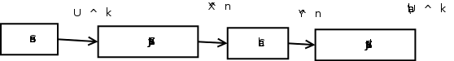

Final
=====
Wed. Dec 11: 9AM-Noon
Mac Corry Hall, Room B201
8.5x11 paper of formulas allowed & small calculator

Material
--------
Notes ch 1-5
Text ch 1-5,7,8,9 (Sec. 9.1,9.2)
HW #1-5

Sample of past exam problems posted on website

**********************
Rate-Distortion Theory
**********************
(Lossy Source Coding)

Consider a DMS :math:`\{X_i\}_{i=1}^\infty` with *finite* alphabet :math:`\mathcal X\sim p_X`

.. admonition:: Definition

    For a given :math:`\mathcal X`, :math:`\mathcal \hat X` is the source reproduction alphabet. (usually :math:`\mathcal X=\mathcal \hat X`, in general :math:`\mathcal \hat X\subseteq \mathcal X`)

    A distortion function, :math:`d(\cdot,\cdot)`:

    .. math::
        d:\mathcal X\times \mathcal \hat X\to[0,\infty)

    :math:`d(x,\hat x)` measures the cost of representing source symbol :math:`x` via :math:`\hat x`.

    - bounded
      
        .. math::
            max_{x,\hat x}d(x,\hat x)<\infty

Common Distortion Measures
==========================
Hamming Distortion measure
--------------------------

.. math::
    d(x,\hat x)=\begin{cases}
        1\text{ if }x\neq \hat x\\
        0\text{ if }x=\hat x
        \end{cases}

.. math::
    E[d(X,\hat X)]=P[X\neq \hat X]

Squared Error
-------------

.. math::
    d(x,\hat x)=(x-\hat x)^2

Additive distortion measure
---------------------------

.. math::
    d(x^n,\hat x^n)=\frac{1}{n}\sum_{i=1}^n d(x_i,\hat x_i)

.. admonition:: Definition

    A :math:`(2^{nR},n)` *rate-distortion* (lossy source) code encoder:

    .. math::
        f_n: \mathcal X^n\to\{1,2,3,...,2^{nR}}

    decoder:

    .. math::
        g_n: \{1,2,3,...,2^{nR}}\to\hat \mathcal X

    *Distortion* associated with code:

    .. math::
        \frac{1}{n}E[d(X^n,g_n(f_n(X^n)))]=\frac{1}{n}\sum_{\mathcal X^n}p_{X^n}(x^n)d(x^n,g_n(f_n(x^n)))

    Codebook:

    .. math::
        \mathcal C=\{g_n(1),...g_n(2^{nR})\}=\{\hat x^n(1),...,\hat x^n(2^{nR})}

.. admonition:: Definition

    Operational Rate-Distortion function:

    Given :math:`D\geq 0`, the *operational rate-distortion function* :math:`R(D)` for a source is the infimum of all rates :math:`R` for which :math:`\exists` a sequence of :math:`(2^{nR},n)` rate-distortion codes :math:`(f_n,g_n)` with

    .. math::
        \lim_{n\to\infty}E[d(X^n,g_n(f_n(X^n)))]\leq D

.. admonition:: Definition

    Information Rate-distoriton function

    .. math::
        R^{(I)}(D):=min_{p_{\hat X|X}: E[d(X,\hat X)]\leq D} I(X;\hat X)

    .. admonition:: Aside
        known: :math:`p_X`

.. admonition:: Theorem (Shannon's Rate-Distortion Theorem for DMS)

    .. math::
        R(D)=R^{(I)}(D):=min_{p_{\hat X|X}: E[d(X,\hat X)]\leq D} I(X;\hat X)

    where :math:`R(D)` is the operational rate-distortion function

    See Text for Proof

.. admonition:: Example (IID Bernoulli source)

    :math:`\{X_i\}` is a binary-valued iid source with :math:`P[X=0]=p`. Consider Hamming distortion measure

    .. math::
        R(D)=\begin{cases}
            h_b(p)-h_b(D), & 0\leq D\leq min(p,1-p)\\
            0 & \text{otherwise}
        \end{cases}

    .. math::
        h_b(x)=-x\log x-(1-x)\log(1-x)

    .. note::
        When :math:`D=0`, :math:`R(D)=h_b(p)=H(X)` - reduces to source coding Theorem.

.. admonition:: Example (Gaussian Source)

    IID Gaussian source :math:`\{X_i\}`

    .. math::
        X_i\sim N(0,σ^2)

    and squared dist. measure :math:`d(x,\hat x)=(x-\hat x)^2`

    .. math::
        R(d)=\begin{cases}
            \frac{1}{2}\log_2 \frac{σ^2}{D} & \text{ if }0<D\leq σ^2\\
            0 & \text{ if }D>σ^2
        \end{cases}

Lossy Joint Source-Channel Coding Theorem
=========================================

(a) If a :math:`rR(D)<C`, then communication of source over the channel via a lossy-JSCC at rate :math:`r` is possible with asymptotic exected distortion :math:`\leq D`
(b) If :math:`rR(D)>C`, not possible.

